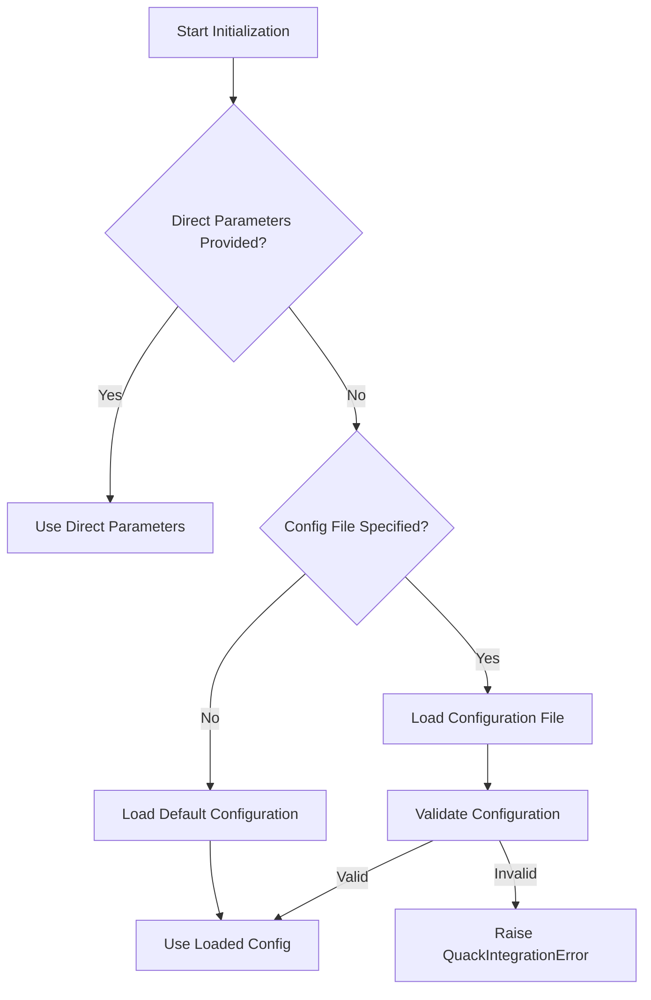

# QuackCore Google Drive Integration Documentation

## Table of Contents

1. [Overview](#overview)
2. [Architecture & Module Structure](#architecture--module-structure)
3. [Setup and Initialization](#setup-and-initialization)
4. [File Operations](#file-operations)
    - [Uploading Files](#uploading-files)
    - [Downloading Files](#downloading-files)
    - [Listing Files](#listing-files)
5. [Folder Operations](#folder-operations)
6. [Permissions Operations](#permissions-operations)
7. [Utility Modules](#utility-modules)
8. [Error Handling & IntegrationResult](#error-handling--integrationresult)
9. [Best Practices & Troubleshooting](#best-practices--troubleshooting)
10. [Extending and Customizing](#extending-and-customizing)
11. [Diagrams and Flowcharts](#diagrams-and-flowcharts)
12. [Summary](#summary)

---

## Overview

The `quack_core.integrations.google.drive` module provides a robust interface for integrating Google Drive operations into QuackTools. It covers everything from file uploads/downloads, folder management, setting file permissions, and listing files, all wrapped in a standardized integration service using custom error handling with `IntegrationResult`.

Key features include:

- **File Operations:** Upload, download, list, and delete files.
- **Folder Operations:** Create and delete folders.
- **Permissions Management:** Set permissions and retrieve sharing links.
- **Utilities:** Query building and API wrappers with exponential backoff.
- **Custom Error Handling:** Consistent error propagation using `IntegrationResult`.

---

## Architecture & Module Structure

The integration is organized into several submodules, each with specific responsibilities:

- **Service Layer (`service.py`):**  
  Contains the `GoogleDriveService` class that provides a unified interface to perform operations (upload, download, list, etc.).

- **Data Models (`models.py`):**  
  Provides Pydantic models (`DriveFile`, `DriveFolder`, `DrivePermission`) to standardize how Google Drive resources are represented.

- **Protocols (`protocols.py`):**  
  Define interfaces (e.g., `DriveService`, `DriveFilesResource`) which help with type checking and enforce method contracts.

- **Utilities (`utils/`):**
  - **Query Utilities (`query.py`):** Functions for building query strings (e.g., `build_query`).
  - **API Utilities (`api.py`):** Functions like `execute_api_request` that wrap API calls in error handling and retry logic.

- **Operations (`operations/`):**  
  Implements specific file and folder operations:
  - **Upload (`upload.py`):** File upload operations.
  - **Download (`download.py`):** File download operations.
  - **Folder Management (`folder.py`):** Create/delete folder operations.
  - **Permissions (`permissions.py`):** Manage file permissions and sharing links.
  - **List Files (`list_files.py`):** File listing operations.

- **Module Initialization (`__init__.py`):**  
  Exposes the core functions and classes including the `create_integration()` helper for auto-discovery.

---

## Setup and Initialization

### Configuration and Authentication

Before performing any operations, you must initialize the Google Drive service. The service requires credentials, client secrets, and optionally a shared folder ID. These can be provided either via parameters to the service or via a configuration file.

### Step-by-Step Initialization Example

```python
# Import the integration entry point
from quack_core.integrations.google.drive import create_integration

# Create a Google Drive integration instance
drive_integration = create_integration()

# Optionally, provide custom paths for client secrets and credentials
# drive_integration = GoogleDriveService(
#     client_secrets_file="path/to/client_secrets.json",
#     credentials_file="path/to/credentials.json",
#     shared_folder_id="your_shared_folder_id"
# )

# Initialize the service
init_result = drive_integration.initialize()

if init_result.success:
    print("Google Drive service initialized successfully.")
else:
    print(f"Initialization failed: {init_result.error}")
```

**Key Points:**

- The configuration is automatically initialized using the `GoogleConfigProvider`.
- If initialization fails, an error message will be propagated via the `IntegrationResult`.

---

## File Operations

The module provides several methods for file operations. Each operation returns an `IntegrationResult` object containing the operation outcome (success or error) along with a message and any relevant content (like a file ID or link).

### Uploading Files

#### Method: `upload_file`
Uploads a local file to Google Drive. It resolves file details, reads the file, uploads via the Google API, and optionally sets the file permissions.

#### Usage Example

```python
upload_result = drive_integration.upload_file(
    file_path="local/path/to/file.txt",
    remote_path="remote_file_name.txt",  # Optional
    description="This is a test file upload",
    parent_folder_id=None,  # Uses shared folder if not specified
    public=True  # Automatically sets file permissions to public
)

if upload_result.success:
    print("File uploaded successfully!")
    print("Access link:", upload_result.content)
else:
    print("File upload failed:", upload_result.error)
```

#### What Happens Under the Hood

1. **File Details Resolution:**  
   The `_resolve_file_details()` method resolves the local file path, determines the filename, and retrieves the MIME type.

2. **API Upload:**  
   The file is read as binary content and uploaded using `googleapiclient` via an in-memory upload mechanism.

3. **Permission Setting:**  
   If the file is to be public, `set_file_permissions()` is called after a successful upload.

### Downloading Files

#### Method: `download_file`
Downloads a file from Google Drive given its file ID. It handles metadata retrieval, resolves the download path, and writes the file locally.

#### Usage Example

```python
download_result = drive_integration.download_file(
    remote_id="google_drive_file_id_here",
    local_path="local/download/directory/or/filename.txt"  # Optional
)

if download_result.success:
    print("File downloaded to:", download_result.content)
else:
    print("Download error:", download_result.error)
```

### Listing Files

#### Method: `list_files`
Lists files under a specified folder or matching a name pattern.  
It utilizes the query building logic from `utils/query.py`.

#### Usage Example

```python
list_result = drive_integration.list_files(
    remote_path="folder_id_here",  # Optional: defaults to shared folder
    pattern="*.txt"  # Optional: pattern matching filenames
)

if list_result.success:
    print("Files found:")
    for file_info in list_result.content:
        print(file_info)
else:
    print("Error listing files:", list_result.error)
```

---

## Folder Operations

Folder management is covered by methods like `create_folder` and `delete_file` (which supports both files and folders).

### Creating a Folder

#### Usage Example

```python
create_folder_result = drive_integration.create_folder(
    folder_name="NewProjectFolder",
    parent_path=None  # Optional: if none, uses shared folder
)

if create_folder_result.success:
    print("Folder created with ID:", create_folder_result.content)
else:
    print("Folder creation error:", create_folder_result.error)
```

### Deleting Files/Folders

#### Usage Example

```python
delete_result = drive_integration.delete_file(
    file_id="file_or_folder_id_here",
    permanent=False  # If True, file is permanently deleted
)

if delete_result.success:
    print("File/folder deletion succeeded.")
else:
    print("Deletion error:", delete_result.error)
```

---

## Permissions Operations

Managing file permissions is essential for sharing and collaboration.

### Setting File Permissions

#### Method: `set_file_permissions`
Sets the permissions on a specified file/folder (defaults to "reader" access for "anyone").

#### Usage Example

```python
perm_result = drive_integration.set_file_permissions(
    file_id="file_id_here",
    role="reader",
    type_="anyone"  # This makes the file public
)

if perm_result.success:
    print("Permissions set successfully.")
else:
    print("Error setting permissions:", perm_result.error)
```

### Getting a Sharing Link

#### Method: `get_sharing_link`
Retrieves the sharing link using metadata fields like `webViewLink` or `webContentLink`.

#### Usage Example

```python
sharing_link_result = drive_integration.get_sharing_link("file_id_here")

if sharing_link_result.success:
    print("Sharing link:", sharing_link_result.content)
else:
    print("Failed to retrieve sharing link:", sharing_link_result.error)
```

---

## Utility Modules

### Query Utilities (`utils/query.py`)

- **`build_query(folder_id, pattern)`**  
  Constructs the query string for listing files based on folder IDs and optional patterns.
  
- **`build_file_fields(include_permissions)`**  
  Creates a field string parameter for file metadata requests.

#### Example Use

```python
from quack_core.integrations.google.drive.utils.query import build_query

query_string = build_query(folder_id="folder_id_here", pattern="*.pdf")
print("Query:", query_string)
```

### API Utilities (`utils/api.py`)

- **`execute_api_request(request, error_message, api_method)`**  
  Wraps an API call to ensure consistent error handling and logging.
  
- **`with_exponential_backoff(func, max_retries, initial_delay, max_delay)`**  
  A decorator to add retry logic to API calls.

#### Example Decorator Usage

```python
from quack_core.integrations.google.drive.utils.api import with_exponential_backoff

@with_exponential_backoff
def sample_api_call():
    # Call a drive API method here
    pass
```

---

## Error Handling & IntegrationResult

Every operation returns an instance of `IntegrationResult` which contains:

- **`.success`** (bool): Indicates whether the operation succeeded.
- **`.content`**: Contains the result (e.g., file ID, download path, file list) if successful.
- **`.message`**: A human-readable message explaining the result.
- **`.error`**: If not successful, this property provides detailed error information.

### How Errors Propagate

1. **Initialization & API Errors:**  
   Methods inside the service (and operations) catch exceptions—such as `QuackApiError` and `QuackBaseAuthError`—log them, and return an error result.
   
2. **Usage in Client Code:**  
   You should always check if `IntegrationResult.success` is `True` before proceeding:
   
   ```python
   result = drive_integration.upload_file("file.txt")
   if result.success:
       print("Upload successful:", result.content)
   else:
       print("Error uploading file:", result.error)
   ```
   
3. **Common Error Scenarios:**  
   - **Authentication Errors:** Problems with credentials or token expiration.
   - **API Errors:** Failures in Google API calls (e.g., quota limits, network issues).
   - **File System Errors:** Issues with reading or writing local files.

---

## Best Practices & Troubleshooting

### Best Practices

- **Always Validate Results:**  
  Check the `success` property of every `IntegrationResult`.
  
- **Use Logging:**  
  Utilize the logging provided by QuackCore to diagnose issues.
  
- **Configuration Management:**  
  Keep your client secrets and credentials secure; consider using environment variables or secured configuration files.
  
- **Modular Design:**  
  Leverage the protocols and models provided to extend or customize the integration without modifying core code.

### Troubleshooting Tips

- **Error Messages:**  
  Review the `error` field in the returned `IntegrationResult` for details. Common messages include failures in authentication or API method execution.
  
- **Network and Quota Issues:**  
  Ensure that your API keys have sufficient quota and that network connectivity to Google’s API endpoints is stable.
  
- **Debugging:**  
  Enable detailed logging by setting an appropriate `log_level` (e.g., `logging.DEBUG`) during initialization to trace API calls.
  
- **IntegrationResult Inspection:**  
  When operations fail, inspect both the `message` and `error` fields to get clues about what went wrong.

---

## Extending and Customizing

### Extending Models

The data models (`DriveFile`, `DriveFolder`, and `DrivePermission`) are based on Pydantic. You can extend these models to include extra metadata if needed:

```python
from quack_core.integrations.google.drive.models import DriveFile
from pydantic import Field

class ExtendedDriveFile(DriveFile):
    extra_metadata: dict[str, str] = Field(default_factory=dict, description="Additional metadata")
```

### Custom Protocols

If you need to customize the integration behavior (e.g., add new operations or override existing ones), implement the defined protocols (`DriveService`, `DriveFilesResource`, etc.). For example, to add a custom file-copy operation, define a new class that implements the required protocol methods and then plug it into your integration.

### Adding New Operations

You can also add new modules under the `operations/` package following the established pattern:
  
1. **Create a new file** in `operations/` (e.g., `copy.py`).
2. **Implement your function** by reusing utilities from `utils/api.py` and `utils/query.py`.
3. **Return results** using `IntegrationResult`.

---

## Diagrams and Flowcharts

Below are a few flowcharts to help visualize the integration flow for key operations.

### File Upload Flow (Mermaid Diagram)
```mermaid
graph TD;
    A[Start Upload Process] --> B[Resolve File Details];
    B --> C[Read File Content from Local FS];
    C --> D[Prepare File Metadata & Media Object];
    D --> E[Call Google Drive API (files.create)];
    E --> F[Check API Response];
    F -- Success --> G[Set File Permissions if Required];
    G --> H[Return Successful IntegrationResult];
    F -- Failure --> I[Catch Exception & Return Error Result];
```

### Download Flow (ASCII Diagram)

```
+-------------------+
| Start Download    |
+--------+----------+
         |
         v
+-------------------+
| Retrieve Metadata |
+--------+----------+
         |
         v
+-------------------+
| Resolve Local     |
| Download Path     |
+--------+----------+
         |
         v
+-------------------+
| Download via API  |
+--------+----------+
         |
         v
+-------------------+
| Write to Disk     |
+--------+----------+
         |
         v
+-------------------+
| Return Integration|
|    Result         |
+-------------------+
```

---

## Summary

- **Initialization:**  
  Use `create_integration()` to obtain a pre-configured `GoogleDriveService` instance. Initialize it to authenticate and set up the API.

- **File & Folder Operations:**  
  Comprehensive methods exist to upload, download, list, create, and delete files/folders. Every operation returns an `IntegrationResult`.

- **Permissions:**  
  Easily set sharing settings and retrieve sharing links to make files public.

- **Utilities and Error Handling:**  
  Built-in utility functions for building queries and managing API calls with exponential backoff guarantee robust error handling.

- **Extensibility:**  
  Follow the patterns and protocols provided to extend or customize the integration for your specific QuackTool.

---

## Authentication and Token Management

Authentication is the first key step when using the Google Drive integration. The module uses an internal class called `GoogleAuthProvider` (located under `quack_core.integrations.google.auth`) to handle all authentication tasks. This provider implements the OAuth 2.0 flow required by the Google API and is responsible for:

- **Reading Client Secrets:** The client secrets file contains your application's client ID and secret provided by the Google API Console.
- **Handling Credentials:** The credentials file is used to store the access token (and refresh token) so that repeated authentications are not needed. If a token is expired, the provider will refresh it using the refresh token.
- **Managing Scopes:** The integration specifies necessary OAuth scopes (like `"https://www.googleapis.com/auth/drive"` and `"https://www.googleapis.com/auth/drive.file"`) that define the level of access for the application.
- **Error Propagation:** If the token retrieval or refresh fails, errors such as `QuackBaseAuthError` are raised and propagated via the `IntegrationResult` to allow client code to handle these scenarios properly.

### Authentication Flow – Step by Step

1. **Configuration Initialization:**  
   During initialization of the `GoogleDriveService`, the provided client secrets and credentials file paths are stored in the configuration dictionary.  
   
2. **Instantiating the Auth Provider:**  
   The `GoogleAuthProvider` is instantiated with the client secrets file, credentials file, and required scopes.  
   
3. **Token Acquisition:**  
   When the `initialize()` method is called on the `GoogleDriveService`, it will call the `get_credentials()` method on the auth provider. This method:
   - Checks if a valid access token is present.
   - Refreshes the token if it is expired (using the refresh token).
   - If neither is present, a new authorization flow is triggered using the OAuth 2.0 process.
   
4. **Building the Drive API Service:**  
   Once valid credentials are obtained, they are used to build the Google Drive API service (using the `googleapiclient.discovery.build` function).

5. **Error Handling in Authentication:**  
   If authentication fails at any point (for example, due to an invalid or expired token, or a missing file), an appropriate error (such as a `QuackBaseAuthError`) is logged and propagated via an `IntegrationResult.error_result`.

### Code Example: Triggering Authentication

Below is a sample snippet that shows how the Google Drive integration is initialized. The authentication flow is triggered as part of the initialization process:

```python
from quack_core.integrations.google.drive import create_integration

# Create an integration instance, optionally providing paths for client secrets and credentials
drive_integration = create_integration()
# Alternatively, you can instantiate directly with custom parameters:
# drive_integration = GoogleDriveService(
#     client_secrets_file="path/to/client_secrets.json",
#     credentials_file="path/to/credentials.json",
#     shared_folder_id="your_shared_folder_id"
# )

# Initialize the service: this triggers the token retrieval/refresh process
init_result = drive_integration.initialize()

if init_result.success:
    print("Google Drive service initialized and authenticated successfully.")
else:
    print("Failed to initialize Google Drive service:", init_result.error)
```

### Authentication Flow Diagram

Below is a Mermaid diagram to visualize the authentication process:

```mermaid
flowchart TD;
    A[Start Initialization] --> B[Load Configuration (client secrets & credentials)];
    B --> C[Instantiate GoogleAuthProvider];
    C --> D[Call get_credentials()];
    D -- Valid Token? --> E[Yes: Return Access Token];
    D -- Valid Token? --> F[No: Check refresh token];
    F -- Refresh Token Valid? --> G[Refresh Token and Return New Access Token];
    F -- Refresh Token Invalid? --> H[Trigger OAuth 2.0 Flow];
    H --> I[Obtain New Access & Refresh Tokens];
    I --> J[Store Credentials];
    J --> E;
    E --> K[Build Google Drive API Service];
    K --> L[Initialization Successful];
```

### Troubleshooting Authentication Issues

- **Invalid/Missing Client Secrets File:**  
  Ensure that the client secrets file contains valid credentials from your Google API Console.
  
- **Expired or Invalid Credentials File:**  
  If the credentials file is outdated or has been revoked, delete it to force a new authentication flow.
  
- **Scope Mismatch:**  
  Verify that the OAuth scopes specified (e.g., `https://www.googleapis.com/auth/drive.file`) cover the operations you need.
  
- **Error Messages:**  
  Look for detailed error messages in the `IntegrationResult.error` field. Common errors may include token expiration, invalid client secrets, or connectivity issues with Google's servers.

### Best Practices for Authentication

- **Secure Storage:**  
  Always protect your client secrets and credentials. Consider using environment variables or secure storage mechanisms.
  
- **Regular Token Refresh:**  
  Ensure that the refresh token is functioning correctly so that the access token is updated automatically.
  
- **Logging:**  
  Enable debug-level logging (via `log_level=logging.DEBUG`) during development to capture detailed authentication flows for troubleshooting.
  
- **Error Checks:**  
  Always check the `IntegrationResult` after initialization to ensure that the authentication step has been successful before performing further operations.

---

## Configuration Management

The Google Drive integration for QuackCore is designed to be flexible and configurable. The integration uses a configuration provider (`GoogleConfigProvider`) to load and validate settings needed for authentication and operation. This section explains how the configuration works, how to override default settings, the expected structure of configuration files, and strategies for managing different environments.

### How Configuration Works

When you initialize the `GoogleDriveService`, it calls an internal method `_initialize_config` that gathers necessary settings from one or more sources:

1. **Direct Parameters:**  
   - If you provide values for `client_secrets_file`, `credentials_file`, or `shared_folder_id` directly when instantiating the service, these values are used immediately.
   - Example:
     ```python
     from quack_core.integrations.google.drive.service import GoogleDriveService

     drive_service = GoogleDriveService(
         client_secrets_file="config/client_secrets.json",
         credentials_file="config/credentials.json",
         shared_folder_id="your_shared_folder_id"
     )
     ```
2. **Configuration File:**  
   - If the direct parameters are not provided, the service looks for a configuration file specified by the `config_path` parameter.
   - The provider (`GoogleConfigProvider`) loads this file and validates it against expected keys and value types.
3. **Default Configuration:**  
   - If neither direct parameters nor a valid configuration file are present, the provider falls back to a built-in default configuration, typically defined in `get_default_config()`.
   - Note: Even the default configuration must pass a validation check before being used; otherwise, a `QuackIntegrationError` is raised.

### Overriding Default Settings via Configuration Files

To override the default settings, create your own configuration file and provide its path when initializing the integration. For example, you could create a JSON file that looks like this:

```json
{
    "client_secrets_file": "config/my_client_secrets.json",
    "credentials_file": "config/my_credentials.json",
    "shared_folder_id": "my_custom_shared_folder_id",
    "public_sharing": true,
    "default_share_access": "reader"
}
```

**Usage Example:**  
Pass the configuration file path during service instantiation:

```python
from quack_core.integrations.google.drive.service import GoogleDriveService

drive_service = GoogleDriveService(config_path="config/my_drive_config.json")
init_result = drive_service.initialize()

if init_result.success:
    print("Service initialized with custom configuration.")
else:
    print("Initialization failed:", init_result.error)
```

### Expected Structure of Configuration Files

A properly formatted configuration file should include at least the following keys:

- **client_secrets_file:**  
  The path to the JSON file containing the Google API client secrets.
  
- **credentials_file:**  
  The path to the file storing your OAuth 2.0 credentials (access token and refresh token).
  
- **shared_folder_id (Optional):**  
  An ID for a folder in Google Drive where files might be uploaded by default.
  
- **public_sharing (Optional):**  
  A boolean value indicating whether files should be made publicly accessible by default.
  
- **default_share_access (Optional):**  
  The default role (e.g., `"reader"` or `"writer"`) to apply when setting file permissions.

A sample configuration file might look like this (formatted in JSON):

```json
{
    "client_secrets_file": "config/client_secrets.json",
    "credentials_file": "config/credentials.json",
    "shared_folder_id": "1aBcD2eFGhiJK3LMNOPqRsTUv",
    "public_sharing": true,
    "default_share_access": "reader"
}
```

Alternatively, you can use other formats (like YAML) if the `GoogleConfigProvider` is configured to support it. Always ensure the file adheres to the expected key names and value types, as the configuration will be validated at runtime.

### Managing Different Environments

In many cases, you’ll have different configuration requirements for various environments such as **development**, **testing**, and **production**. Here are some strategies to manage these environments effectively:

1. **Separate Configuration Files:**  
   - Create separate configuration files for each environment:
     - `config/dev_drive_config.json`
     - `config/test_drive_config.json`
     - `config/prod_drive_config.json`
   - When deploying or initializing the service, specify the corresponding file:
     ```python
     drive_service = GoogleDriveService(config_path="config/prod_drive_config.json")
     ```

2. **Environment Variables:**  
   - Use environment variables to dynamically select the configuration file. For example, you can read an environment variable `ENV` to determine which configuration file to load:
     ```python
     import os
     env = os.getenv("ENV", "dev")  # defaults to "dev" if ENV is not set
     config_path = f"config/{env}_drive_config.json"
     drive_service = GoogleDriveService(config_path=config_path)
     ```
     
3. **Configuration Overriding:**  
   - You can override specific settings at runtime by providing direct parameters to the `GoogleDriveService` constructor. These parameters take precedence over the values loaded from the configuration file. This is useful if, for example, you need to temporarily change the `shared_folder_id` or `public_sharing` flags without editing the config file.

4. **Version Control Considerations:**  
   - Avoid committing production credentials or secrets to version control. Use placeholder files (or a template file) for configuration and load sensitive information via environment variables or secure configuration management tools during deployment.

### Diagram: Configuration Management Flow

Below is a Mermaid diagram representing the configuration management workflow:



---

## Summary

- **Direct Parameters vs. Configuration File:**  
  Directly provided parameters override any settings in a configuration file. If neither is provided, built-in defaults are used.

- **Configuration File Structure:**  
  The configuration file should include keys for client secrets, credentials, shared folder settings, and sharing preferences.

- **Environment Management:**  
  Manage different environments by using separate configuration files, environment variables, or runtime overrides.
