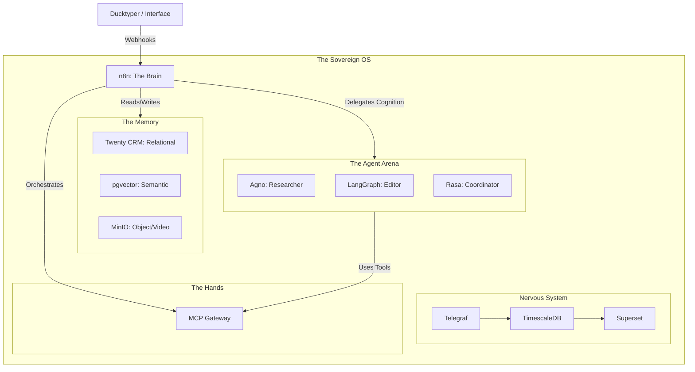

# 🎬 Quackshowrunner

**The Sovereign Operating System for the AI-First Media Company.**

> **Quackshowrunner is opinionated infrastructure.** It is built to replace roles, not tasks.
> *"The future of media is not bigger teams. It is better systems."* — [The AI-First Media Operating Doctrine (v1)](https://www.google.com/search?q=./MANIFESTO.md)

---

## 🧠 The Vision

**Quackshowrunner** is the physical manifestation of **Pillar B (Automation & Orchestration)** of our operating doctrine.

It is a production-grade, self-hosted infrastructure stack designed to act as a **Media Operating System**. It creates a "Sovereign Cloud" where AI agents perform organizational functions traditionally done by humans (Research, Editing, Production Management).

### Core Philosophy

1. **AI Replaces Roles, Not Tasks:** We don't build chatbots; we build "digital employees."
2. **Visible Control Plane:** **n8n** is the manager. If a process cannot be visualized in a flow, it does not exist.
3. **The "Agent Arena":** We are agnostic about *cognition*. We provide a standard interface so you can swap "Brains" (Rasa, Agno, LangGraph) to learn the trade-offs of each.
4. **Pedagogical Mandate:** Infrastructure is curriculum. This codebase teaches you *how* to build sovereign AI.

---

## 🏟 The Agent Arena (Pluggable Cognition)

Unlike other stacks that lock you into one framework, Quackshowrunner uses a **Standard Agent Contract** to plug different AI backends into the same OS.

We include three reference implementations to teach the "Spectrum of Autonomy":

| Framework | Archetype | The Lesson | Best For |
| --- | --- | --- | --- |
| **Rasa** | **The Specialist** | *When to use NLU vs. LLMs.* Shows how rigid "Intents" create safety in customer-facing roles. | **Coordinator:** Scheduling, Guest Management (Compliance heavy). |
| **Agno** | **The Speedster** | *How to build lightweight agents.* Shows pure Pythonic speed and tool usage without graph bloat. | **Researcher:** Web scraping, Fact-checking, Summarization loops. |
| **LangGraph** | **The Architect** | *Managing stateful complexity.* Shows how to build agents that critique their own work and retry. | **Editor:** Script drafting, Style review, "Chief of Staff." |

### How It Works (Docker Profiles)

You choose your fighter at runtime.

```bash
# Run with the Research Brain
docker compose --profile agno up

# Run with the Editorial Brain
docker compose --profile langgraph up

```

---

## 🏗 Architecture (v2 Vision)

The stack is the central nervous system connecting the Writer (Ducktyper) to the World.



### 1. The Manager (n8n)

* **Role:** The visible control plane.
* **The Rule:** n8n never "thinks." It routes data and delegates thinking to the **Agent Arena**.

### 2. The Hands (MCP Gateway)

* **Service:** **Supergateway** (exposing Postgres/Tools via SSE)
* **The Contract:** n8n and Agents never touch the database directly; they ask the MCP Gateway to do it. This standardizes tool access across all frameworks.

### 3. The Memory (Context)

* **Relational Memory (Twenty CRM):** The "State" of the company (Deals, Guests).
* **Semantic Memory (pgvector):** The "Voice" of the company (Style guides, Past content).
* **Object Memory (MinIO):** The "Vault" (Raw video assets).

### 4. The Curriculum (Docusaurus)

* **The Feedback Loop:** When an agent learns a new trick, it opens a PR to this repo's documentation. The infrastructure writes its own manual.

---

## 🚧 Current Status & Roadmap

We are currently transitioning from **v1 (POC)** to **v2 (The Vision)**.

* [ ] **Infrastructure Hardening:**
* [x] Docker Compose modular architecture.
* [x] Automated Borgmatic backups (to Hetzner Storage Box).
* [x] "Nuclear Recovery" scripts.


* [ ] **The "Brain" Upgrade (The Arena):**
* [x] Deploy MCP Gateway (Supergateway).
* [ ] **Reference Implementation 1:** Agno (The Researcher).
* [ ] **Reference Implementation 2:** LangGraph (The Editor).
* [ ] **Reference Implementation 3:** Rasa (The Coordinator).


* [ ] **The "Memory" Refactor:**
* [ ] **Migration:** EspoCRM → **Twenty CRM**.
* [ ] **New Service:** Add **MinIO (S3)** for video assets.
* [ ] **New Feature:** Enable `pgvector` in Postgres.


* [ ] **The "Curriculum" Pivot:**
* [ ] **Migration:** Wiki.js → **Docusaurus**.
* [ ] **Pipeline:** Build the "Agent-to-PR" documentation loop.


---

## 📂 Directory Structure (Vision)

```text
quackshowrunner/
├── apps/
│   ├── n8n/              # The Manager
│   ├── mcp-gateway/      # The Interface (Tools)
│   ├── twenty/           # The Memory (CRM)
│   ├── minio/            # The Storage (Video)
│   ├── docusaurus/       # The Curriculum
│   ├── superset/         # The Eyes
│   │
│   # The Agent Arena (Pluggable Brains)
│   ├── agent-agno/       # Pythonic/Fast Agent
│   ├── agent-langgraph/  # Stateful/Graph Agent
│   └── agent-rasa/       # NLU/Deterministic Agent
│
├── conf/                 # Infrastructure as Code
│   ├── nginx/            # Zero-Trust Gatekeeper
│   ├── postgres/         # DB Init & Vector Extension
│   └── timescale/        # Telemetry Schemas
├── scripts/              # The "Sovereign" Toolset
│   ├── nuclear-recovery.sh
│   └── deploy.sh
└── docker-compose.yml    # The Orchestration File

```

---

## 🔌 Integrations

Quackshowrunner is the "Backend" of the operation.

* **Ducktyper:** The writing interface. Connects via secured webhooks.
* **QuackCore:** The shared logic library.

---

## 🤝 Contributing

This repository follows the **Pedagogical Mandate**.

1. **Documentation First:** No PR is merged without updating the Docusaurus docs.
2. **Idempotency:** Setup scripts must run safely multiple times without breaking the state.
3. **Manifesto Alignment:** Does your change help AI replace a role?

---

*“If it cannot be shown in a flow, it cannot be trusted.”*